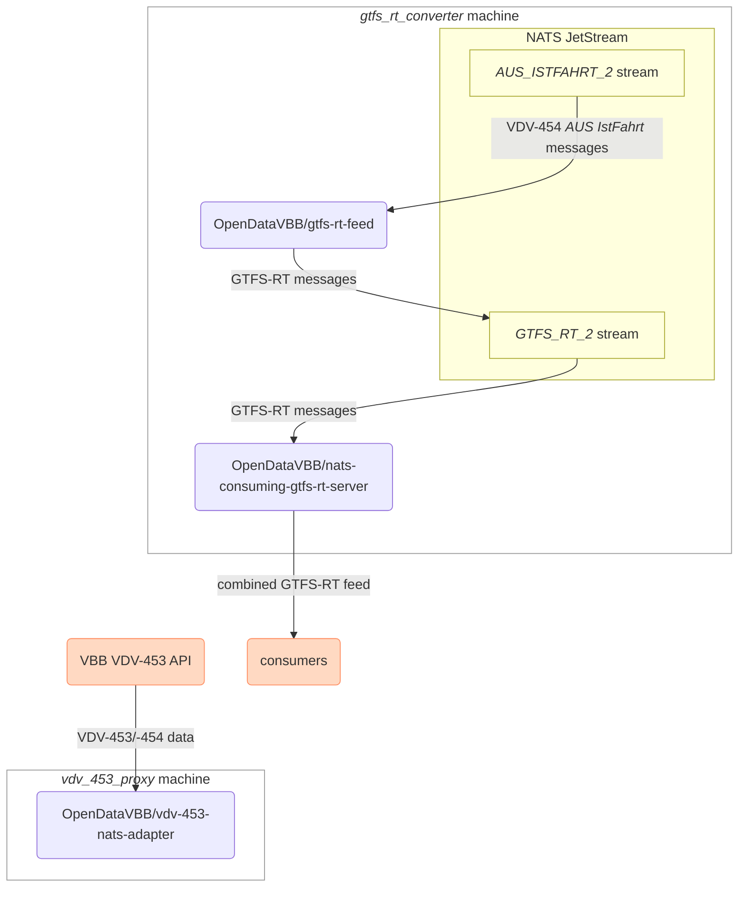

# VBB GTFS Realtime feed – Ansible setup

This repo **configures the machines that the [VBB GTFS Realtime (GTFS-RT) feed](https://github.com/OpenDataVBB/gtfs-rt-feed) runs on** using [Ansible](https://docs.ansible.com/ansible/latest/index.html).

> [!NOTE]
> The password required to decrypt the [Ansible-Vault](https://docs.ansible.com/ansible/10/cli/ansible-vault.html)-encrypted secrets in this repository must be in a plain text file at `~/.vault-passwords/vbb-gtfs-rt-infrastructure.private`.

## VDV-453 proxy machines

> [!NOTE]
> Ansible group: `vdv_453_proxy`

These two (staging & production) machines will act as "proxies" (in a logical sense, not in a technical sense) between VBB's VDV-453 API and the machines converting the data to GTFS-RT.

They are VPSes hosted at [Planetary Networks](https://www.planetary-networks.de). They can be administered using their [management UI](https://console.planetary-networks.de:8800/).

## VDV-453 -> GTFS-RT conversion machines

> [!NOTE]
> Ansible group: `gtfs_rt_converter`

These machines convert VDV-453 data, convert it into the GTFS-RT format, and serve the GTFS-RT feeds via HTTP.

> [!TIP]
> Currently, the production machine `vbb_gtfs_rt_production` does not exist yet.
