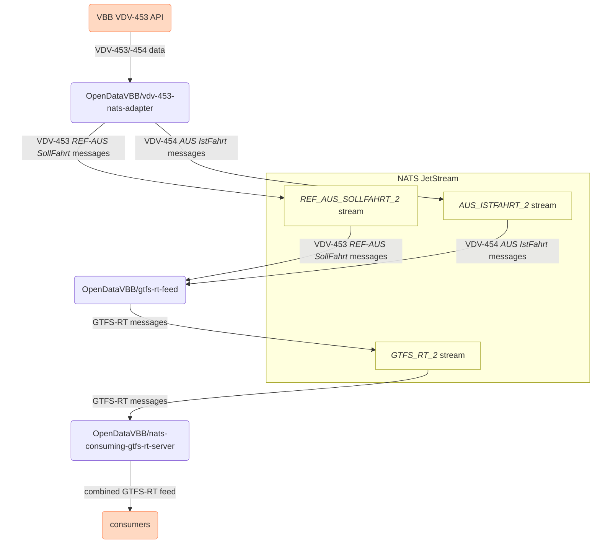

# VBB GTFS Realtime feed – Ansible setup

This repo **configures the machines that the [VBB GTFS Realtime (GTFS-RT) feed](https://github.com/OpenDataVBB/gtfs-rt-feed) runs on** using [Ansible](https://docs.ansible.com/ansible/latest/index.html).

> [!TIP]
> If you're just looking for VBB's publicly deployed GTFS-RT feed:
> - [actual GTFS-RT feed](https://production.gtfsrt.vbb.de) ([staging](https://staging.gtfsrt.vbb.de))
> - [parsed in `gtfs-rt-inspector`](https://public-transport.github.io/gtfs-rt-inspector/?feedUrl=https%3A%2F%2Fproduction.gtfsrt.vbb.de%2Fdata&view=inspector) ([staging](https://public-transport.github.io/gtfs-rt-inspector/?feedUrl=https%3A%2F%2Fstaging.gtfsrt.vbb.de%2Fdata&view=inspector))

> [!NOTE]
> The password required to decrypt the [Ansible-Vault](https://docs.ansible.com/ansible/10/cli/ansible-vault.html)-encrypted secrets in this repository must be in a plain text file at `~/.vault-passwords/vbb-gtfs-rt-infrastructure.private`.

## VDV-453 proxy machines

> [!NOTE]
> Ansible group: `vdv_453_proxy`

These two (staging & production) machines will act as "proxies" (in a logical sense, not in a technical sense) between VBB's VDV-453 API and the machines converting the data to GTFS-RT.

They are VPSes hosted at [Planetary Networks](https://www.planetary-networks.de). They can be administered using their [management UI](https://console.planetary-networks.de:8800/).

## VDV-453 -> GTFS-RT conversion machines

> [!NOTE]
> Ansible group: `gtfs_rt_converter`

These machines convert VDV-453/VDV-454 data (sent by the respective `vdv_453_proxy` machine, see above), convert it into the GTFS-RT format, and serve the GTFS-RT feeds via HTTP.

They are connected to their respective VDV-453/VDV-454 proxy machine via a [Wireguard](https://www.wireguard.com) tunnel, letting them communicate via a [NATS message queue](https://nats.io).
